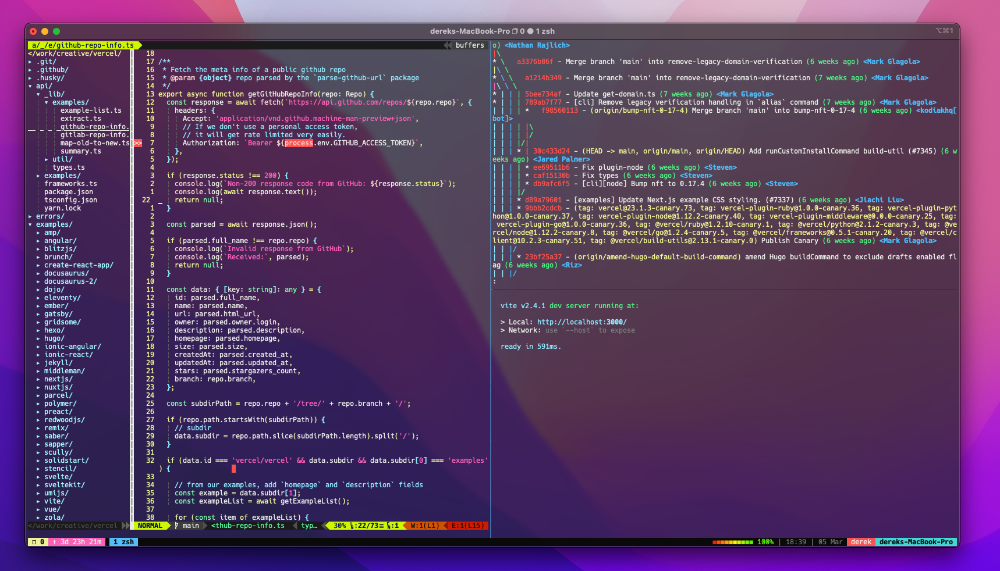

🎨 Screenshots

--- 
>dark theme(only works on 24-bit true color terminal and true color vim):  



### Quick start

```bash
$ ln -s <source_file> <target_file>s

# use start.sh (under repo's dir)

$ sh start.sh

# e.g. (under $HOME)

$ ln -s dotfiles/vim/.vimrc .vimrc
```

### Install:
pip install powerline-status --user

### Issues:
 - YouCompleteMe unavailable no module named frozendict 
 - YouCompleteMe unavailable no module named future

### Solution:
```
cd ~/.vim/bundle/YouCompleteMe
git submodule update --init --recursive
```

[My dev workflow](https://github.com/metaczen/blog/issues/1)
